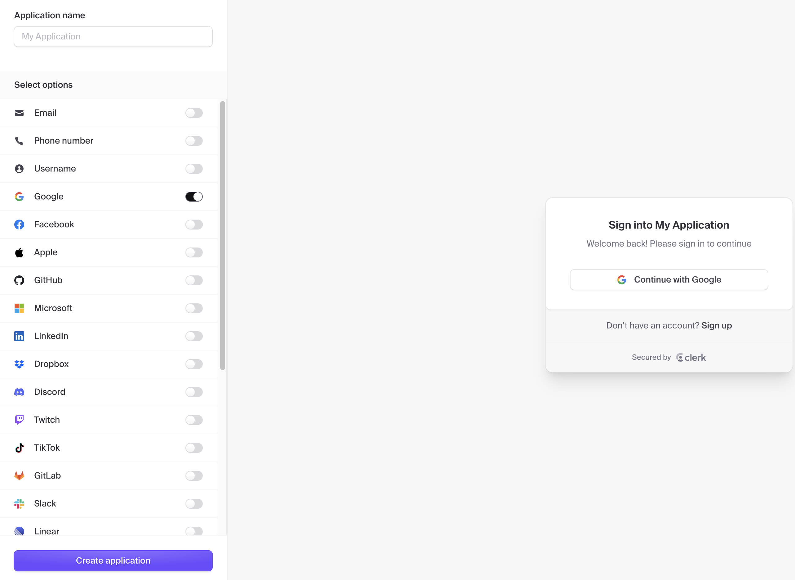
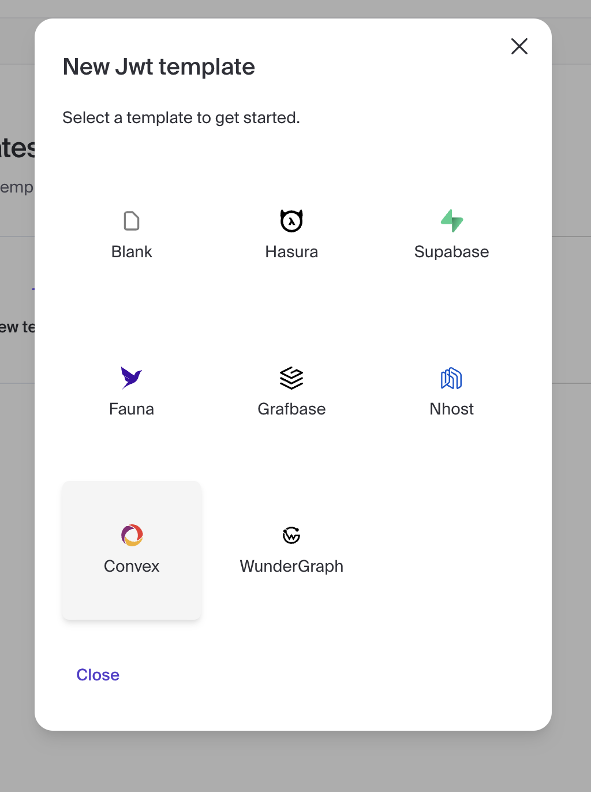

# /retrospectool

<!-- ALL-CONTRIBUTORS-BADGE:START - Do not remove or modify this section -->
[](#contributors-)
<!-- ALL-CONTRIBUTORS-BADGE:END -->

A real-time, collaborative **agile retrospective** tool. Create a board, share the link,
and run your team's retro together on three columns — **Good** (what went well),
**Bad** (what to improve), and **Actions** (action items) — with everything syncing live
for every participant.

> The repository is named `meli-project-management`, but the product it ships is
> `/retrospectool`. It is a personal open-source project.

## Features

- 🟢🔴🟣 **Three-column retro board** — Good / Bad / Actions.
- ⚡ **Real-time collaboration** — all changes sync instantly via Convex.
- 🔐 **Sign in with Google** (Clerk); anyone with the link can join a board.
- 🙈 **Anonymous notes** and a **hide/blur mode** to keep notes hidden until reveal.
- 👍 **Likes**, **assign action items** to participants, and **drag & drop** to reorder.
- 🧲 **Merge notes** — drag one card onto another, or multi-select and merge.
- ⏱️ **Per-board timer** to keep the session on track.
- ✨ **AI-generated action items** from your "Bad" notes (OpenAI / Anthropic via the
  Vercel AI SDK).
- 🔊 **Text-to-speech** playback of a note (ElevenLabs).

## Tech stack

- **[Next.js 13](https://nextjs.org/)** (App Router) + **React 18** + **TypeScript**
- **[Convex](https://convex.dev/)** — reactive database and serverless backend
- **[Clerk](https://clerk.com/)** — authentication (Google sign-in), integrated with Convex
- **[Vercel AI SDK](https://sdk.vercel.ai/)** with OpenAI & Anthropic providers
- **[ElevenLabs](https://elevenlabs.io/)** — text-to-speech
- **Tailwind CSS** + **[shadcn/ui](https://ui.shadcn.com/)** (Radix UI), **dnd-kit**, Lottie

## Prerequisites

- **Node.js `v18.3`** (see [`.nvmrc`](./.nvmrc)) — `nvm use` if you have nvm.
- A free **[Convex](https://convex.dev/)** account.
- A free **[Clerk](https://clerk.com/)** account.
- *(Optional)* OpenAI / Anthropic and ElevenLabs API keys for the AI and speech features.

## Setup

Install dependencies:

```shell
npm ci
```

### 1. Create a Clerk application (Google sign-in)

Create an application on Clerk and enable the **Google** option:



### 2. Create a Convex JWT template in Clerk

Go to **JWT Templates** in the Clerk dashboard and create one using the **Convex** option:



### 3. Create a Convex project

Sign up at [convex.dev](https://convex.dev) and create a new project.

### 4. Configure the `CLERK_JWT_ISSUER_DOMAIN` on Convex

In the Convex dashboard, go to **Settings → Environment Variables → + Add** and create
`CLERK_JWT_ISSUER_DOMAIN`. Its value is the **Issuer** shown on the JWT template you
created in Clerk — something like `https://<your-subdomain>.clerk.accounts.dev`.

### 5. Configure local environment variables

Copy the example file and fill in your keys:

```shell
cp env.example .env.local
```

| Variable                            | Where            | Purpose                                            |
| ----------------------------------- | ---------------- | -------------------------------------------------- |
| `CONVEX_DEPLOYMENT`                 | `.env.local`     | Written automatically by `npm run convex:dev`.     |
| `NEXT_PUBLIC_CONVEX_URL`            | `.env.local`     | Convex endpoint (public).                          |
| `NEXT_PUBLIC_CLERK_PUBLISHABLE_KEY` | `.env.local`     | Clerk publishable key (public).                    |
| `CLERK_SECRET_KEY`                  | `.env.local`     | Clerk server key (**secret**).                     |
| `CLERK_JWT_ISSUER_DOMAIN`           | Convex dashboard | Set in step 4 (not in `.env.local`).               |
| `OPENAI_API_KEY`                    | `.env.local`     | Optional — AI action items (**secret**).           |
| `ANTHROPIC_API_KEY`                 | `.env.local`     | Optional — AI action items (**secret**).           |
| `ELEVEN_LABS_API_KEY`               | `.env.local`     | Optional — text-to-speech (**secret**).            |

> `.env.local` is gitignored — never commit real secret values. `NEXT_PUBLIC_*` values
> are inlined into the client bundle and are public by design.

### 6. Start the dev servers

In one terminal:

```shell
npm run dev
```

In another terminal:

```shell
npm run convex:dev
```

The first `convex dev` run finishes wiring up `.env.local` for you.

### You're all set!

Open [http://localhost:3000](http://localhost:3000).

## Scripts

| Script                  | Description                              |
| ----------------------- | ---------------------------------------- |
| `npm run dev`           | Start the Next.js dev server.            |
| `npm run convex:dev`    | Start the Convex dev server (watch mode).|
| `npm run build`         | Production build.                        |
| `npm run start`         | Serve the production build.              |
| `npm run lint`          | Run ESLint (`next lint`).                |

There is no automated test suite yet; validate changes with `npm run lint` and a manual
browser smoke test.

## Project structure

```
convex/   # Backend: schema + serverless queries/mutations (data lives here)
src/app/  # Next.js App Router pages and API routes
src/components, src/helpers, src/services, src/contexts  # UI, hooks, integrations
```

See **[AGENTS.md](./AGENTS.md)** for a detailed architecture overview, data model, and
conventions.

## For AI coding agents

This repo is set up for AI coding assistants. Start with **[AGENTS.md](./AGENTS.md)**
(canonical context) and **[CLAUDE.md](./CLAUDE.md)** (Claude Code notes).

## Contributors ✨

Thanks goes to these wonderful people ([emoji key](https://allcontributors.org/docs/en/emoji-key)):

<!-- ALL-CONTRIBUTORS-LIST:START - Do not remove or modify this section -->
<!-- prettier-ignore-start -->
<!-- markdownlint-disable -->
<table>
  <tbody>
    <tr>
      <td align="center" valign="top" width="14.28%"><a href="https://mercadolivre.com.br"><br /><sub><b>Rômulo Guimarães</b></sub></a><br /><a href="https://github.com/romulo1984/meli-project-management/commits?author=romulo1984" title="Code">💻</a></td>
      <td align="center" valign="top" width="14.28%"><a href="https://jorgeemanoel.com"><br /><sub><b>Jorge Emanoel</b></sub></a><br /><a href="https://github.com/romulo1984/meli-project-management/commits?author=JorgeEmanoel" title="Code">💻</a></td>
    </tr>
  </tbody>
</table>

<!-- markdownlint-restore -->
<!-- prettier-ignore-end -->

<!-- ALL-CONTRIBUTORS-LIST:END -->

This project follows the [all-contributors](https://github.com/all-contributors/all-contributors) specification. Contributions of any kind welcome!
