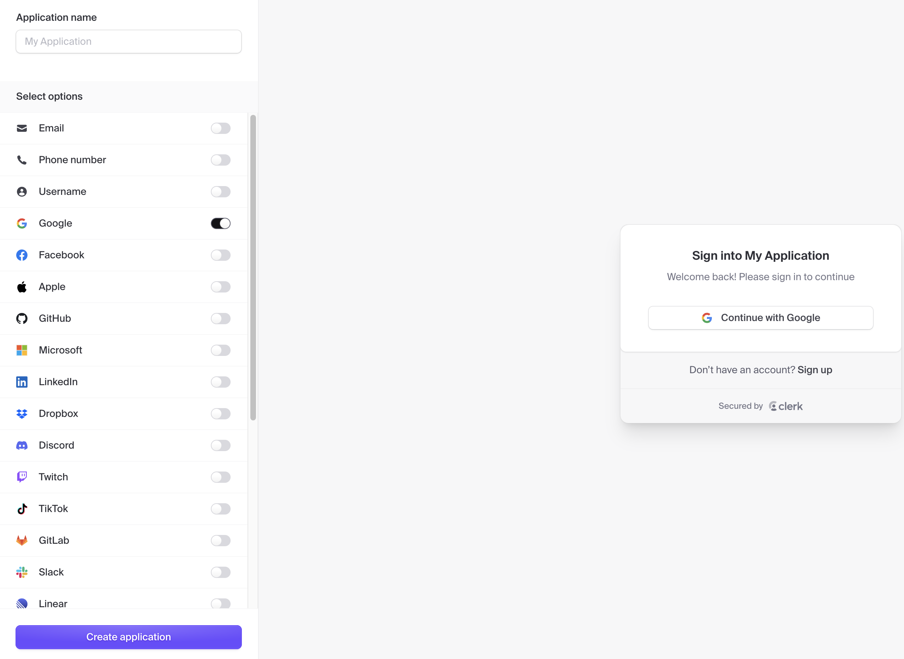
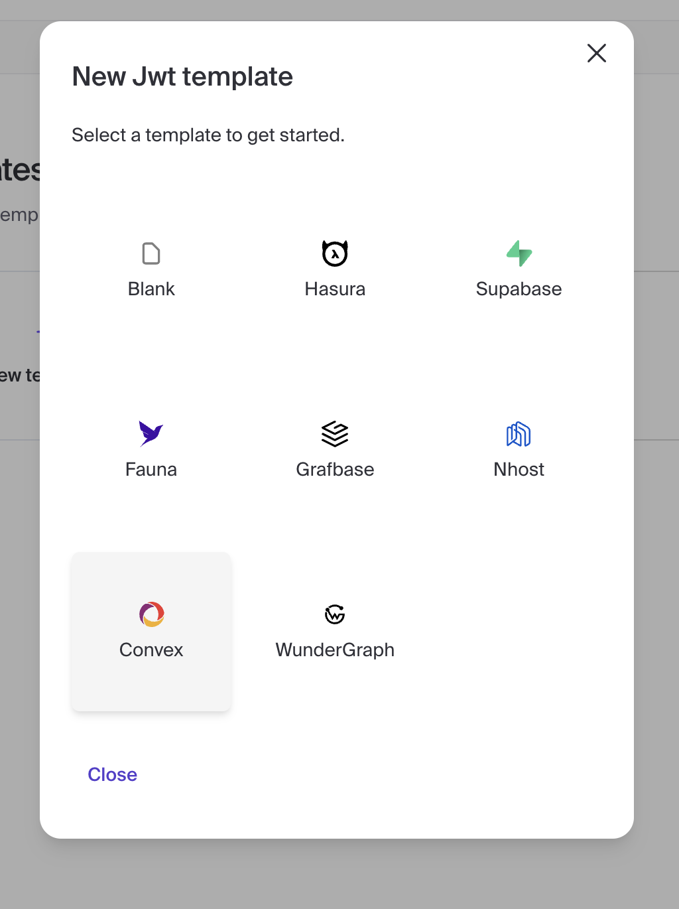

## meli-project-management

This project is a retrospective tool, which allows you to create boards to be used in retrospectives, considering the forma "went well, to improve, action items".

## Installation

In order to run this project, you gotta make sure the dependences are correctly installed:
```shell
npm ci
```

This projects uses the following technologies:

- [convex](https://convex.dev/)
- [clerk](https://clerk.com/)

So, for you to be able to run it, it is required that you have an account on each of the platforms above.

## Running

### 1. Create an application on Clerk selecting the google option (like the image below):


### 2.  Go to the JWT Templates and create on using the "Convex" option:


### 3. Create an account under convex.dev
Go to: [https://convex.dev](https://convex.dev) and create an account.

### 4. Create a new project and configure an env key
Go to **Settings -> Environment Variables -> + Add** and create on named `CLERK_JWT_ISSUER_DOMAIN`.
You can find its value on details page of the JTW Template you just created on clerk. Look for the section **Issuer**.
The value should be something like this: `https://something-awkward-here.clerk.accounts.dev`.

### 5. Start the envionments

In one terminal run:
```
npm run dev
```

In another terminal run:
```
npm run convex:dev
```

You should see a new file called `.env.local` in your project's root folder.

### Youre all set!

Go to http://localhost:3000